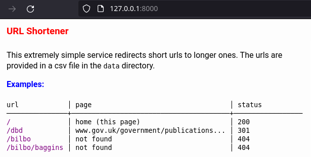

# url-shortener

v0.0.1 : 24 June 2024 : first release

## Resolve short urls and redirect them

This web service uses a csv file to provide short urls which redirect to
remote urls.

In development mode live reloading of the (minimal) web templates is
supported, and the remote urls are checked on startup.

In production mode the assets, including the csv file, are embedded into
the binary.

```
Usage:
  url-shortener 

A url-shortening web server

This uses a simple csv file of short,long urls as a database.

Run with the -d/-development flag to run in development mode, providing
live template reloads. In development mode, the urls are also checked at
startup.


Application Options:
  -i, --ipAddress=   ipaddress (default: 0.0.0.0)
  -p, --port=        port (default: 8000)
  -d, --development  run in development mode
  -t, --timeout=     http client timeout (default: 5s)
  -w, --workers=     http client workers (default: 8)

Help Options:
  -h, --help         Show this help message

```



## Licence

Licensed under the [MIT Licence](LICENCE).
